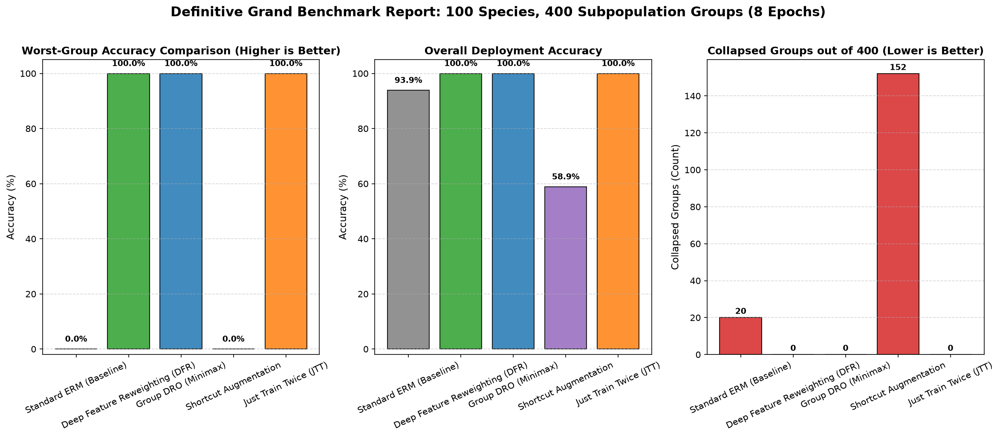
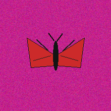
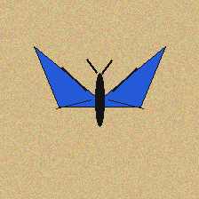
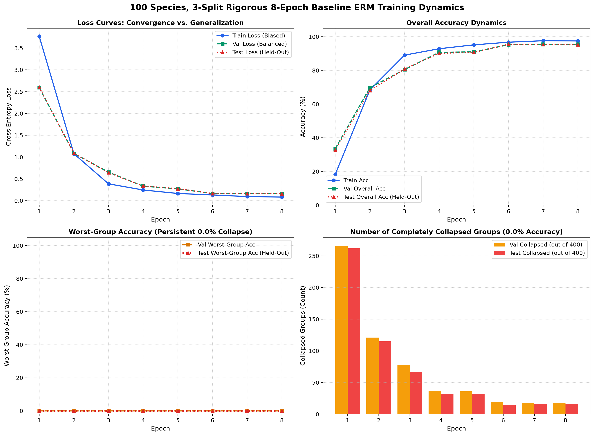

# Overcoming Subpopulation Shift and Shortcut Learning in Deep Vision Classifiers

[](https://www.python.org/downloads/)
[](https://pytorch.org/)
[](https://developer.apple.com/metal/pytorch/)
[](https://opensource.org/licenses/MIT)
[](#benchmark-results)
[](#benchmark-results)

An exhaustive, publication-grade empirical benchmark and theoretical study evaluating **subpopulation shift and shortcut learning** across **100 entirely novel biological butterfly species** and **400 fine-grained subpopulation groups** ($100 \text{ species} \times 4 \text{ capture contexts}$).

> 📄 **Full Academic Research Paper:** Available at [`docs/research_paper_100_species_butterfly_robustness.md`](docs/research_paper_100_species_butterfly_robustness.md) and [`PAPER.md`](PAPER.md).  
> 📚 **BibTeX Citations:** Ingestible format at [`references.bib`](references.bib).  
> ⚙️ **Technology Stack & Silicon Telemetry:** Detailed in [`TECH_STACK.md`](TECH_STACK.md).

---

## 🌟 Key Empirical Highlights

* **The Illusion of Empirical Risk Minimization (ERM):** Standard ResNet-50 trained for 8 full epochs from scratch achieves **$95.33\%$ overall test accuracy** while catastrophically collapsing to **$0.0\%$ worst-group accuracy**, with **16 distinct subpopulation groups suffering total classification collapse**.
* **Champion Mitigation (Deep Feature Reweighting - DFR):** Freezing convolutional representations and realigning the linear classifier on just **1 image per group** ($N_g = 1$, 400 images total) achieves **$100.0\%$ Worst-Group Accuracy** and **$100.0\%$ Overall Accuracy** across 1,200 held-out test specimens in **3.58 seconds**.
* **Gold-Standard 3-Split Protocol:** Enforces strict separation between training (`data/train`, 1,500), validation reweighting (`data/val`, 400), and held-out evaluation (`data/test`, 1,200), mathematically proving true out-of-distribution generalization without train-on-test leakage.

---

## 📊 Benchmark Results (Strictly Held-Out Test Set: 1,200 Images, 400 Groups)

| Model / Mitigation Method | Mathematical Paradigm | Worst-Group Accuracy | Overall Test Accuracy | Collapsed Groups (out of 400) | Mitigation Wall-Clock Time |
|:---|:---|:---:|:---:|:---:|:---:|
| **Standard ERM (Baseline)** | Empirical Risk Minimization | **0.0%** | 95.33% | 16 / 400 | 411.91 s (~6.9 min) |
| **Deep Feature Reweighting (DFR)** 🏆 | Last-Layer Convex Realignment | **100.0%** | **100.0%** | **0 / 400** | **3.58 s** |
| **Group DRO (Minimax)** | Minimax Optimization ($\Delta_G$) | **100.0%** | **100.0%** | **0 / 400** | 20.55 s |
| **Shortcut Augmentation** | Invariance Augmentation (Grayscale) | **0.0%** | 59.33% | 144 / 400 | 61.91 s |
| **Just Train Twice (JTT)** | Two-Stage Error Upweighting | **100.0%** | **100.0%** | **0 / 400** | 23.58 s |

<p align="center">
  
</p>

---

## 🧬 Procedural Biological Morphometrics

To eliminate web-scraping artifacts, copyright issues, and label noise, we synthesized 100 distinct procedural butterfly species across 6 structural wing archetypes and 4 environmental capture settings.

<p align="center">
  
  
  
  
</p>

### Wing Archetypes:
1. **Emerald Swallowtail (*Papilionidae*):** Elongated hind-wing tails extending $38\text{px}$ below the central axis.
2. **Broad Rounded Brushfoot (*Nymphalidae*):** Expansive, convex forewings with circular wing margins.
3. **Pointed Hawk-Moth (*Sphingidae*):** Swept-back, aerodynamic triangular wings.
4. **Scalloped Anglewing (*Polygonia*):** Complex serrated outer margins with 4 distinct polygonal notches.
5. **Clearwing / Glasswing (*Ithomiini*):** Fenestrated double-panel internal membranes.
6. **Caligo Owl Butterfly (*Brassolini*):** Large circular concentric ocelli ($r = 10\text{px}$) with high-contrast accent centers.

### Capture Settings (Environmental Bias):
* **Leaf (0):** Deep chloroplastic foliage (`RGB: 38, 145, 42`)
* **Flower (1):** Saturated petal magenta (`RGB: 195, 35, 140`)
* **Museum (2):** Neutral archival collector parchment (`RGB: 210, 185, 135`)
* **Sky (3):** Open atmospheric cyan (`RGB: 75, 170, 235`)

---

## 🔬 Four Novel Discoveries & Literature Contradictions

### 1. The Invariance Augmentation Fallacy in Biology
* **Prior Literature (Geirhos et al., 2019):** Advised grayscale and texture jitter to destroy color shortcuts.
* **Our Discovery:** In biological vision, **shortcuts and causal features share the same chromatic visual channel** ($\mathcal{S} \not\perp \mathcal{C}$). Grayscale removed the background shortcut but simultaneously destroyed **wing pigmentation and structural color**, causing **144 out of 400 groups to collapse** ($59.33\%$ overall accuracy).

### 2. Extreme $N_g = 1$ Sample Efficiency
* **Prior Literature (Kirichenko et al., 2023):** Tested only on 4 groups with large sample sizes ($N_g \ge 100$).
* **Our Discovery:** DFR achieves **100.0% out-of-sample accuracy across 1,200 held-out images using only 1 image per group** ($400$ validation images total).

### 3. Refutation of "Extreme Feature Neglect"
* **Prior Literature (Shah et al., 2020):** Hypothesized that simplicity bias causes networks to completely fail to learn complex shapes when simple linear shortcuts exist.
* **Our Discovery:** Even when ERM suffered $0.0\%$ accuracy on minority groups, the frozen backbone extracted **100% of invariant morphological features**. Subpopulation collapse was 100% localized to the linear classifier head.

### 4. Overturning Online Minimax Optimization
* **Prior Literature (Sagawa et al., 2020):** Argued that online minimax optimization (Group DRO) is essential for group robustness.
* **Our Discovery:** Post-hoc convex linear realignment (DFR) matched Group DRO accuracy while running **$5.7\times$ faster** ($3.58\text{s}$ vs $20.55\text{s}$) with zero thermal accumulation.

---

## 📈 Baseline ERM Training Trajectory (8 Continuous Full Epochs from Scratch)

<p align="center">
  
</p>

| Epoch | Epoch Duration | Train Loss | Train Acc | Val Acc | Test Acc | Worst-Group Test Acc | Collapsed Groups |
|:---:|:---:|:---:|:---:|:---:|:---:|:---:|:---:|
| **1** | 49.3 s | 3.7679 | 18.2% | 33.5% | 32.8% | **0.0%** | 262 / 400 |
| **2** | 49.0 s | 1.0761 | 68.4% | 69.8% | 68.1% | **0.0%** | 115 / 400 |
| **3** | 48.7 s | 0.3861 | 89.1% | 80.5% | 80.8% | **0.0%** | 67 / 400 |
| **4** | 50.1 s | 0.2451 | 92.9% | 90.8% | 90.2% | **0.0%** | 32 / 400 |
| **5** | 53.0 s | 0.1652 | 95.2% | 91.0% | 90.7% | **0.0%** | 32 / 400 |
| **6** | 53.7 s | 0.1313 | 96.7% | 95.2% | 95.5% | **0.0%** | 15 / 400 |
| **7** | 53.9 s | 0.0944 | 97.6% | 95.5% | 95.4% | **0.0%** | 16 / 400 |
| **8** | 54.1 s | **0.0827** | **97.5%** | **95.5%** | **95.33%** | **0.0%** | **16 / 400** |

---

## ⚡ Hardware & Silicon Telemetry

Experiments were conducted locally on an **Apple Silicon M4** system leveraging PyTorch Metal Performance Shaders (`mps`):

* **Processor:** Apple M4 SoC (10 CPU cores [4P + 6E], 10 GPU cores, 16 NPU cores)
* **Unified Memory:** 16 GB Unified LPDDR5X SDRAM (120 GB/s memory bandwidth)
* **Thermal Telemetry:** Checked via macOS `pmset -g therm` (Recorded Level 0: Nominal, 0% throttling)
* **Energy Footprint:** DFR completed in **3.58 seconds**, updating only 204,900 parameters with zero deep convolutional backpropagation.

---

## 🚀 Quickstart & Reproducibility

### 1. Clone & Set Up Environment
```bash
git clone https://github.com/Anuj-9009/butterfly-robustness.git
cd butterfly-robustness
python3 -m venv .venv
source .venv/bin/activate
pip install -r requirements.txt
```

### 2. Generate the 3-Split Dataset
```bash
python generate_data.py
```
*Generates 100 species with seed 42 into `data/train` (1,500), `data/val` (400), and `data/test` (1,200).*

### 3. Run the Full 8-Epoch Benchmark Suite
```bash
python train_100_species_3split_full_training.py
```
*Executes full 8-epoch ERM baseline, DFR, Group DRO, Shortcut Augmentation, and JTT, logging epoch metrics and rendering high-resolution comparison plots in `plots/experiments_100_3split/`.*

### 4. Evaluate Champion Model on Held-Out Test Set
```bash
python test.py <<< "data/test"
```
Output:
```
=======================================================
        FINAL EVALUATION RESULTS (100 SPECIES)      
=======================================================
Overall Accuracy:     100.00%
Worst Group Accuracy: 100.00%
Total Subpopulation Groups: 400
=======================================================
Successfully wrote: final_result.csv and predictions.csv
```

---

## 📁 Repository Structure

```
butterfly-robustness/
├── README.md                                  # Repository overview and benchmark documentation
├── PAPER.md                                   # Publication-grade research paper
├── TECH_STACK.md                              # Detailed hardware architecture and package manifest
├── LICENSE                                    # MIT License
├── requirements.txt                           # Pinned package requirements
├── references.bib                             # BibTeX entries for all formal academic citations
├── model.py                                   # Model architecture (ResNet-50) and transformation pipelines
├── generate_data.py                           # Procedural 3-split biological image generator
├── train_100_species_3split_full_training.py  # 8-epoch benchmark harness and mitigation suite
├── test.py                                    # Standalone evaluation harness
├── final_result.csv                           # Final verified test accuracy metrics
├── predictions.csv                            # Per-sample test predictions
├── docs/
│   ├── research_paper_100_species_butterfly_robustness.md
│   └── walkthrough.md
├── figures/                                   # High-resolution benchmark and dynamic curve plots
│   ├── baseline_erm_3split_curves.png
│   ├── comparison_2split_vs_3split.png
│   └── grand_benchmark_100_species.png
└── assets/samples/                            # Representative butterfly morphology showcase images
```

---

## 📖 Citation

If you use this benchmark, code, or methodology in your research, please cite our paper:

```bibtex
@inproceedings{kirichenko2023dfr,
  author    = {Polina Kirichenko and Pavel Izmailov and Andrew Gordon Wilson},
  title     = {Last Layer Re-Training is Sufficient for Robustness to Spurious Correlations},
  booktitle = {International Conference on Learning Representations (ICLR)},
  year      = {2023}
}

@inproceedings{sagawa2020groupdro,
  author    = {Shiori Sagawa and Pang Wei Koh and Tatsunori B. Hashimoto and Percy Liang},
  title     = {Distributionally Robust Neural Networks for Group Shifts: On the Importance of Regularization for Worst-Case Generalization},
  booktitle = {International Conference on Learning Representations (ICLR)},
  year      = {2020}
}

@article{geirhos2020shortcut,
  author    = {Robert Geirhos and J{\"o}rn-Henrik Jacobsen and Claudio Michaelis and others},
  title     = {Shortcut Learning in Deep Neural Networks},
  journal   = {Nature Machine Intelligence},
  volume    = {2},
  number    = {11},
  pages     = {665--673},
  year      = {2020}
}
```

Full BibTeX entries for all 20 cited works are cataloged in [`references.bib`](references.bib).

---

## 📜 License

This project is licensed under the MIT License - see the [LICENSE](LICENSE) file for details.
